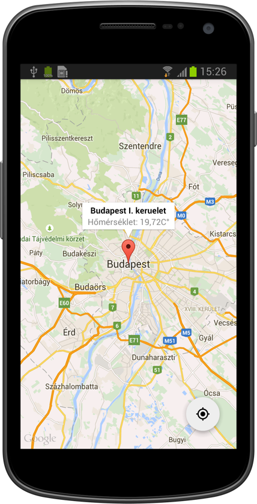

Weather Tap Demo App
====================

This Google Maps demo android app shows the current weather conditions at the tapped location using the [OpenWeatherMap](http://openweathermap.org) web API.
Simply tap on the map to find the nearest place which has weater information. Tap on the FAB (floating action button in the bottom right corner) to jump to your current location.

Sample API request
------------------
[http://api.openweathermap.org/data/2.5/find?lat=47.296361931215344&lon=19.066610522568226&cnt=5&units=metric]
(http://api.openweathermap.org/data/2.5/find?lat=47.296361931215344&lon=19.066610522568226&cnt=5&units=metric)

Parameters:

* lat - the latitude coordinate of the tapped location
* lon - the longitude coordinate of the tapped location
* cnt - is the limit in the vicinity of the tapped location
* units - unit system of the response data

The __units__ parameter the unit system of the data (f.ex.: Celsius degree for temperature or km/h for
wind speed.) This app uses only the metric system for demonstration purpose.

For more information visit the [Open Weather Map API]
(http://openweathermap.org/api) page.

Compatibility
-------------
Android 4.0 or greater (API level 14 Icecream Sandwich).

Libraries used and highly recommended
-------------------------------------
- [Android Support Library v7.](http://developer.android.com/tools/support-library/index.html)
- [Android Design Suppor Library](http://android-developers.blogspot.hu/2015/05/android-design-support-library.html) for the FAB and Snackar stuff.
- [Espresso 2.0 and Android testing support lib](https://developer.android.com/training/testing/ui-testing/espresso-testing.html) for some basic instrumentatio test.
- [JUnit 4](junit.org) for some unit testing fun.
- [Genymotion Emulator](https://www.genymotion.com) for its lightning fast performance specially with Espresso testing.
- [Butterknife](http://jakewharton.github.io/butterknife/) [Jake Wharton](https://github.com/JakeWharton)'s awesome view injection tool.
- [A very easy Logging tool](https://github.com/zserge/log)

License
-------
Feel free to modify this app to your liking, and suggest improvements.
